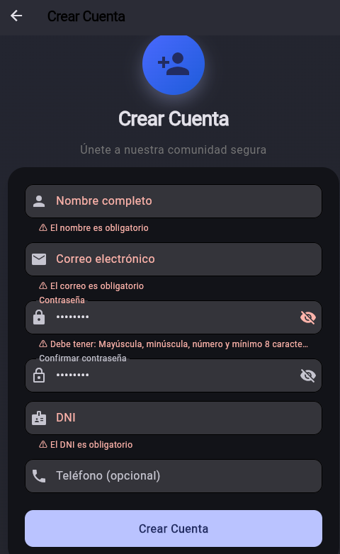
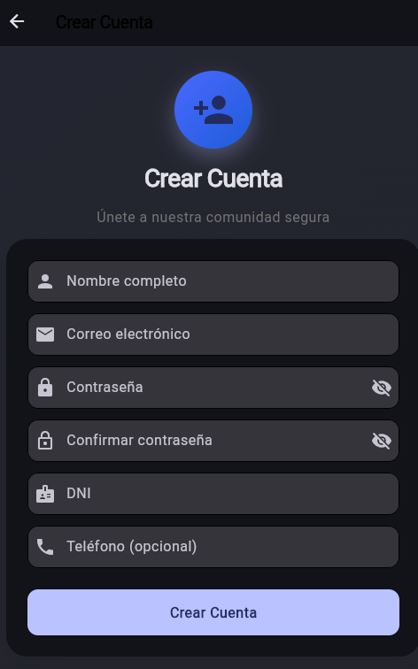
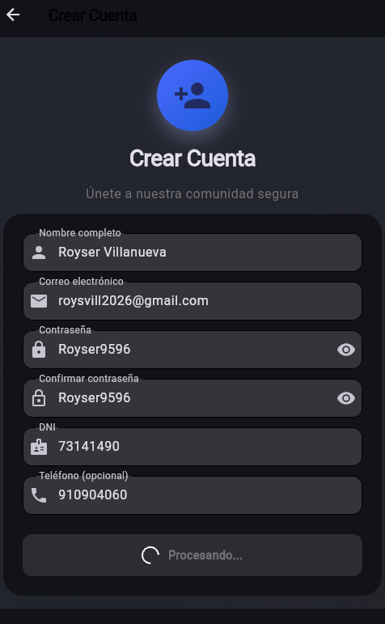
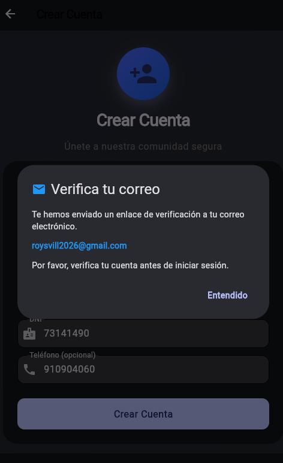

# SM2_EXAMEN_VALIDACIONES - Formulario de Registro con Validaciones Avanzadas

## 📋 Información General

| Campo | Información |
|-------|-------------|
| **Curso** | Soluciones Moviles II |
| **Nombre del Alumno** | Royser Alonsso Villanueva Mamani |
| **Código de Estudiante** | 2021071090 |
| **Fecha** | 02/06/2026 |
| **Repositorio** | https://github.com/RoyserVillanueva/SM2_EXAMEN_VALIDACIONES.git |

---

## 🎯 Detalle de la Implementación

### Pantalla Seleccionada: Registro de Usuario (`RegisterScreen`)

Se implementó un formulario completo de registro que valida los siguientes campos:

| Campo | Validación | RegEx Utilizado |
|-------|------------|-----------------|
| Nombre | Requerido, mínimo 3 caracteres | - |
| **Correo Electrónico** | Formato estándar | `^[a-zA-Z0-9._%+-]+@[a-zA-Z0-9.-]+\.[a-zA-Z]{2,}$` |
| **Contraseña** | Mayúscula, minúscula, número, mínimo 8 caracteres | `^(?=.*[a-z])(?=.*[A-Z])(?=.*\d).{8,}$` |
| Confirmar Contraseña | Coincidencia con contraseña | - |
| **DNI** | 8 dígitos numéricos exactos | `^\d{8}$` |
| **Teléfono** | 9 dígitos numéricos exactos (opcional) | `^\d{9}$` |

### Expresiones Regulares Implementadas (CA2)

#### 1. Correo Electrónico
```dart
static final RegExp _emailRegExp = RegExp(
  r'^[a-zA-Z0-9._%+-]+@[a-zA-Z0-9.-]+\.[a-zA-Z]{2,}$',
);
```
**Explicación:** Valida que el correo tenga formato usuario@dominio.com, permitiendo puntos, guiones y signos en el nombre de usuario.
#### 2. Contraseña Segura
```dart
static final RegExp _passwordRegExp = RegExp(
  r'^(?=.*[a-z])(?=.*[A-Z])(?=.*\d).{8,}$',
);
```
**Explicación:** Exige al menos una minúscula, una mayúscula, un número y una longitud mínima de 8 caracteres.
#### 3. DNI
```dart
static final RegExp _dniRegExp = RegExp(r'^\d{8}$');
```
**Explicación:** Valida exactamente 8 dígitos numéricos.
#### 4. Teléfono
```dart
static final RegExp _phoneRegExp = RegExp(r'^\d{9}$');
```
**Explicación:** Valida exactamente 9 dígitos numéricos.

### Capturas del funcionamiento del formulario

#### 1. Errores de Validación



#### 2. Estado de carga

**Antes de Cargar**

**Despues**


#### 3. Envio de Verificación de correo


